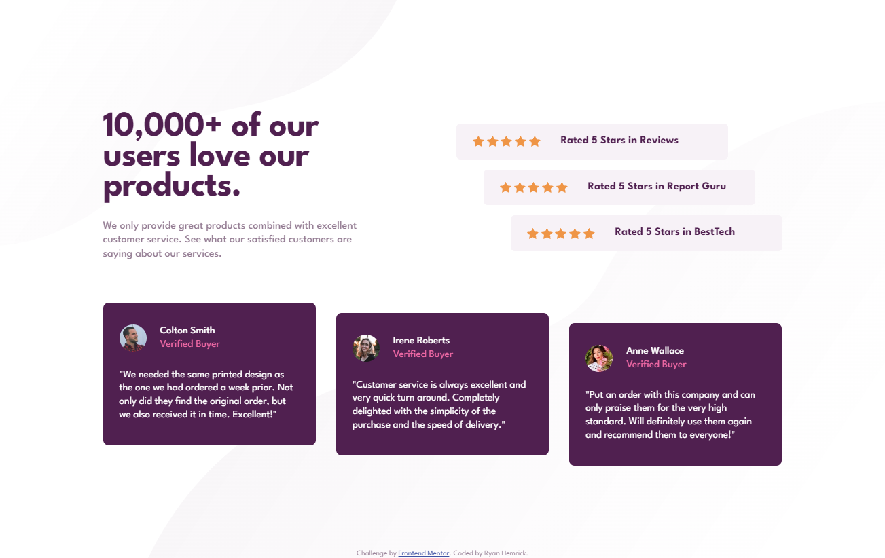

# Frontend Mentor - Social proof section solution

This is a solution to the [Social proof section challenge on Frontend Mentor](https://www.frontendmentor.io/challenges/social-proof-section-6e0qTv_bA). Frontend Mentor challenges help you improve your coding skills by building realistic projects. 

## Table of contents

- [Overview](#overview)
  - [The challenge](#the-challenge)
  - [Screenshot](#screenshot)
  - [Links](#links)
- [My process](#my-process)
  - [Built with](#built-with)
  - [What I learned](#what-i-learned)
  - [Continued development](#continued-development)
- [Author](#author)

## Overview
- A responsive 'social proof section' built with HTML and CSS (flexbox)

### The challenge
- Build out this social proof section and get it looking as close to the design as possible.

### Screenshot

### Links
- Live Site URL: https://strong-elf-9e8e8b.netlify.app

## My process
- Utilized flexbox on the **body** element to vertically and horizontally center the social-proof-section.
- Used a *flex container* wrapper element to stack the two main sections with a *flex-direction* of 'column'
- Used **display: flex;** on the two **section** elements to get a responsive row
- Used additional flexbox positioning in areas where I needed to get multiple elements to sit next to eachother and respond to screen resize
- Used one media query to adjust **flexbox** behavior, positoning, and spacing for mobile

### Built with
- Semantic HTML5 markup
- CSS custom properties
- Flexbox

### What I learned
- How to work with more complex flexbox layouts that contain nested flex containers.
- How to approach a project with a more complex layout; understanding which elements need to be flex containers and how they should behave with relation to the other elements on the page
- How to use semantic HTML to define a testimonial item, instead of just using div elements

### Continued development
- Create an alternate version using CSS Grid instead of flexbox

## Author
- Ryan Hemrick